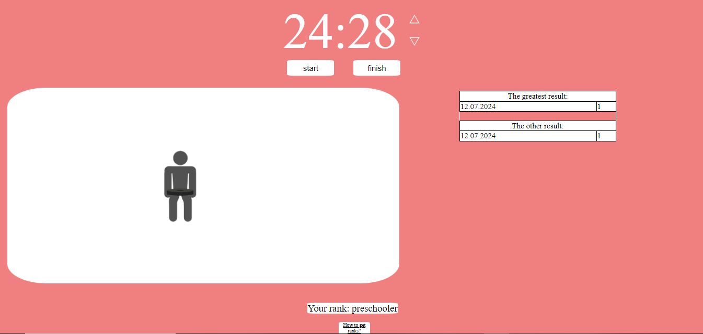

# POMODORO

## Описание

Pomodoro - это приложение для управления временем, основанное на технике Pomodoro. Оно помогает вам организовать рабочие сеансы и улучшить продуктивность.

## Скриншоты


*Стартовая страница приложения*


*Основная страница с таймером для отслеживания времени*


*Основная страница с таймером для отслеживания времени, где работаете не только Вы*


*Основная страница с таймером для отслеживания времени, где работаете не только Вы*


*Основная страница с таймером для отслеживания времени, где работаете не только Вы*


*Основная страница с таймером для отслеживания времени, где работаете не только Вы*


*Основная страница с таймером для отслеживания времени, где отдыхаете не только Вы*


*Основная страница с таймером для отслеживания времени, где отдыхаете не только Вы*


*Страница с рангами, отображающая ваш прогресс*

## Установка

1. Клонируйте репозиторий:
    ```sh
    git clone https://github.com/kattiers/pomodoro_gym.git
    ```

2. Откройте проект в вашем любимом текстовом редакторе.

3. Запустите `index.html` в браузере, чтобы увидеть приложение в действии.

## Использование

- Перейдите на главную страницу и начните обучение, нажав на "start learning".
- Используйте таймер для отслеживания рабочего времени.
- Просматривайте свои ранги на соответствующей странице.

## Авторы

- [Екатерина Шупикова](https://github.com/kattiers)